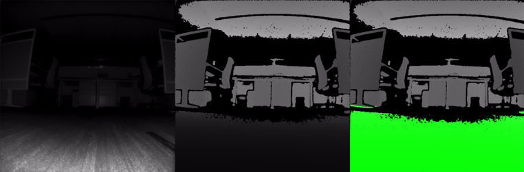
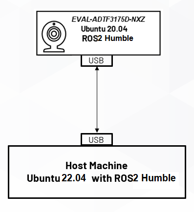
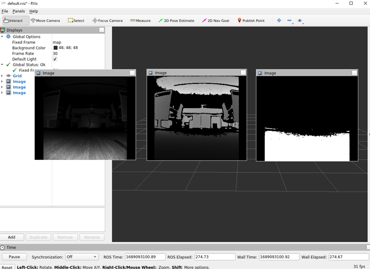
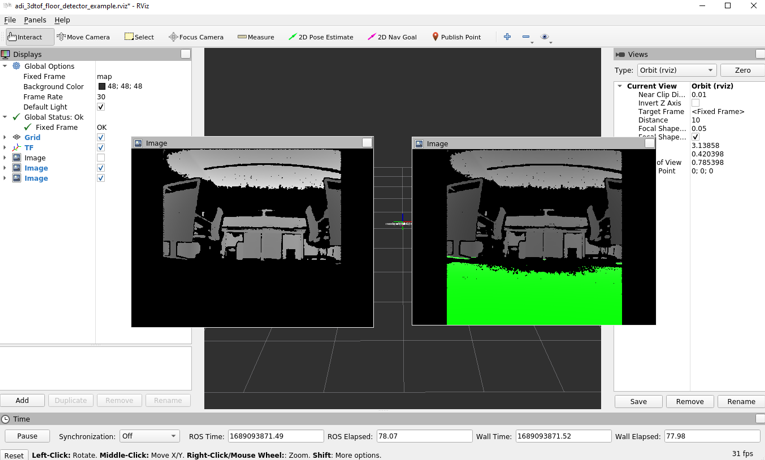
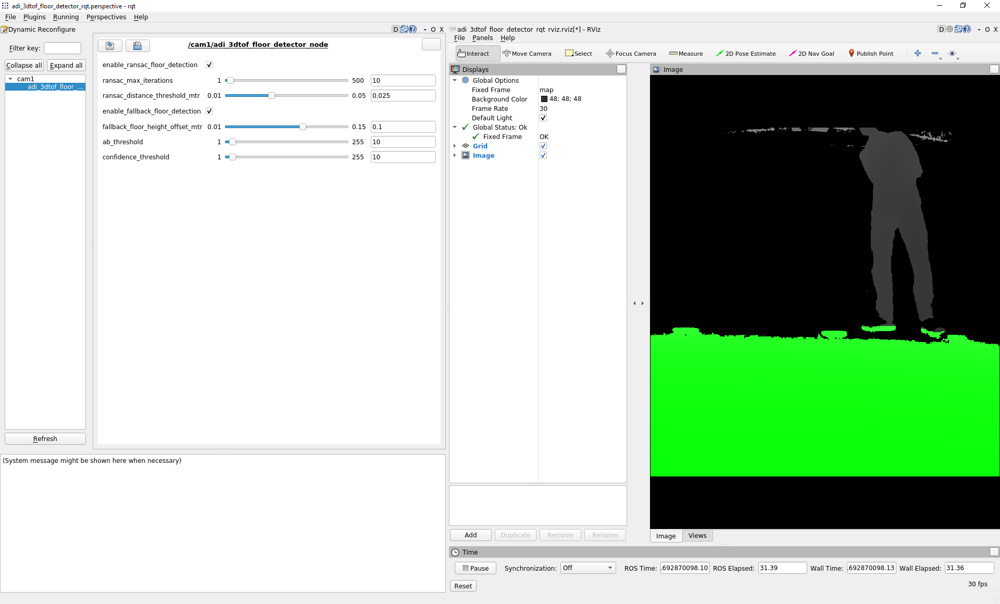

<h1 style="text-align: center;" > Analog Devices 3DToF Floor Detector</p>

---
## Overview
The **ADI 3DToF Floor Detector** is a ROS (Robot Operating System) package for the Floor Detection application. The term "Floor Detection" refers to determining where the floor is in the given image. It is an image segmentation problem in which a given image is divided into floor and non-floor pixels. Floor Detection is an essential component of real-world applications such as Robot Navigation, Autonomous Driving, Augmented reality (AR) applications, and 'Obstacles Detection and Avoidance' for robots and people with inadequate vision.
Here is the sample output of **ADI 3DToF Floor Detector**. From the left, IR image & Depth image and Floor marked depth image can be seen below.


<div style="text-align:center"></div>


The **ADI 3DToF Floor Detector** is developed as a ROS application running on the ADI’s *EVAL-ADTF3175D-NXZ* Time-of-Flight platform. The node uses [*ADI ToF SDK*](https://github.com/analogdevicesinc/ToF/) APIs to capture the frames from the sensor. The algorithm runs on the captured depth image and the outputs are published as ROS topics. The Floor Detection algorithm is highly optimized to run at the average of 60FPS on the *EVAL-ADTF3175D-NXZ* platform. The node publishes the Camera Info, Floor Mask Image of 512x512 (8bits per pixel) resolution along with Depth & IR Images of 512x512 (16 bits per image) resolution at 30FPS. 

[](http://wiki.ros.org/noetic) [](https://releases.ubuntu.com/focal/)   [](./LICENSE)

---
# Background
- Supported Time-of-flight boards: [ADTF3175D](https://www.analog.com/en/products/adtf3175.html)
- Supported ROS and OS distro: Noetic (Ubuntu 20.04)
- Supported platform: armV8 64-bit (aarch64), armV8 64-bit (arm64) and Intel Core x86_64(amd64) processors(Core i3, Core i5 and Core i7)

# Hardware
- [EVAL-ADTF3175D-NXZ Module](https://www.analog.com/en/design-center/evaluation-hardware-and-software/evaluation-boards-kits/EVAL-ADTF3175.html#eb-overview)
- USB type-C to type-A cable - with 5gbps data speed support
- Host laptop with intel i5 or higher cpu running Ubuntu-20.04LTS or WSL2 with Ubuntu-20.04

 :memo: *Note:* 
 Refer the [EVAL-ADTF3175D-NXZ User Guide](https://wiki.analog.com/resources/eval/user-guides/eval-adtf3175d-nxz) to ensure the Eval module has the adequate power supply during the operation.

The below diagram shows the architecture of the required hardware setup.


<div style="text-align:center"></div>


The image below shows the connection diagram of the actual setup :


<div style="text-align:center"></div>
  
  
> :memo:
> **ADSD3500 Firmware**  
> Make sure the sensor is flashed with the compatible ADSD3500 firmware. The minimum version is listed below:  
> **CR/DV series : 4.1.0.0**  
> **AM series : 4.2.0.0**  
> Follow the below instructions to read the ADSD3500 FW version  
>1. Login to the EVAL-ADTF3175D-NXZ module using ssh. On the Host machine open the “Terminal” and run the following command to logging into the device.  
>    ```bash
>       $ ssh analog@10.42.0.1
>         Username: analog   
>         Password: analog     
>    ```  
>2. Run the follwing commands
>   ```bash
>       $ cd ~/Workspace/Tools/ctrl_app
>       $ ./ctrl_app
>   ```
> The output would look like below,  
>   **V4L2 custom control interface app version: 1.0.1**  
>   **59 31**   
>   **<span style="color:red">**04 02 01 00**</span> 61 35 39 61 66 61 64 36 64 36 63   38 65 37 66 62 31 35 33 61 32 64 62 38 63 64 38 38 34 30 33 35 39 66 31 37 31 39 35 61**   
>   **59 31**   
> The first four bytes in the third line represents the FW version. For example for the output above, the version is **4.2.1.0**  

> If the firware version is older than this please upgrade the FW using the following instructions.
>1. Install ADI ToF SDK release [v4.2.0](https://github.com/analogdevicesinc/ToF/releases/tag/v4.2.0)  
>2. Switch to the installation folder and run the following commands to download the image.  
>   ```bash
>       $ cd ~/Analog\ Devices/ToF_Evaluation_Ubuntu_ADTF3175D-Relx.x.x/image.
>       $ chmod +x get_image.sh and ./get_image.sh.
>   ```
>-   Latest image will be downloaded at ./image path as NXP-Img-Relx.x.x-ADTF3175D-.zip. Extract this file using the below command.
>
>   ```bash
>       $ unzip NXP-Img-Relx.x.x-ADTF3175D-.zip
>   ``` 
>
>-   This folder contains the NXP image and ADSD3500 firmware(Fw_Update_x.x.x.bin).  
>3. Run the following command to copy the Fimware to the NXP device.
>   ```bash
>       $ scp Fw_Update_4.2.4.bin analog@10.42.0.1:/home/analog/Workspace
>          Username: analog 
>          Password: analog
>   ```    
>4. Now login to the device and run the Firmware upgrade command.  
>**:warning: <span style="color:red"> Do not interrupt/abort while the upgrade is in progress.Doing this may corrupt the module.**</span>  
>   ```bash
>        $ ssh analog@10.42.0.1 
>           Username: analog 
>           Password: analog   
>        $ cd Workspace/ToF/build/examples/data_collect/
>        $ ./data_collect --fw ~/Workspace/Fw_Update_x.x.x.bin config/config_default.json
>   ```  
>-  Reboot the board after the successful operation.           
> For more details refer to [EVAL-ADTF3175D-NXZ NVM upgrade guide](https://wiki.analog.com/resources/eval/user-guides/eval-adtf3175d-nxz-upgrade-firmware)
  
---
# Software Setup and Running the ROS node on the EVAL-ADTF3175D-NXZ
1. Download and install the latest version of *ADI 3DToF Floor Detector* from the Release page.


2. After installing the software, go to the installation folder(~/Analog Devices/ADI3DToFFloorDetector-Relx.x.x) and run the 'get_image.sh' script. This script will download the custom Ubuntu 20.04 image for the EVAL-ADTF3175D-NXZ. 


3.	Flash the '.img' file to the SD card, follow steps in this link[EVAL-ADTF3175D-NXZ Users Guide](https://wiki.analog.com/resources/eval/user-guides/eval-adsd3100-nxz/flashing_image_instructions) to flash the .img file to SD card.
    

    :memo: *Note:* 
    This image contains the necessary software and code to start using the ROS node. The source code for the ```adi_3dtof_floor_detector``` can be found in ```/home/analog/catkin_ws/src/```

4.	Follow the instructions below to run the *adi_3dtof_floor_detector* application on the EVAL-ADTF3175D-NXZ module.

5.	Connect the EVAL-ADTF3175D-NXZ module to the PC using the USB3.0 cable and wait for the network to come up. By default, the device ip is set to **10.42.0.1**. Refer to          [EVAL-ADTF3175D-NXZ Startup Guide](https://wiki.analog.com/eval-adtf3175d-nxz-startup#software_download) for details.

6.	Login to the EVAL-ADTF3175D-NXZ module using ssh. On the Host machine open the “Terminal” and run the following command to ssh to the device.
    ```bash
    $ ssh analog@10.42.0.1 
      Username: analog 
      Password: analog   
    ```


    :memo: *Note:* 
    If you do not have a Linux Host machine, then install Windows Subsystem for Linux(WSL2) with Ubuntu 20.04.
    Refer to this [link](https://learn.microsoft.com/en-us/windows/wsl/install) for instructions.

> :memo:
> **Setting Date/Time**  
> Make sure the Date/Time is set properly before compiling and running the application. Connecting to a WiFi network would make sure the Date/Time is set properly. The custom Ubuntu
> 20.04 image is configured to connect to a network with following SSID and Password by default.  
>  ```
>  SSID : ADI  
>  Password: analog123  
> ```  
> You can either setup a network with the above properties or configure the Device to connect to any available network.  
> Alternatively, the Host machine can be setup as a local NTP server and the devices can be configured to update Date/Time using the Host machine.  
> Refer to below links for setting and configuring NTP on Ubuntu machines.
>-  https://ubuntuforums.org/showthread.php?t=862620  
>-  https://timetoolsltd.com/ntp/how-to-install-and-configure-ntp-on-linux/  

7. The ROS Noetic and dependent packages are already installed in the EVAL-ADTF3175D-NXZ image and the source code for the *adi_3dtof_floor_detector* is present in `/home/analog/catkin_ws/src/` folder. The package is also pre-built, hence there is no need to build the package. 
  
    If the source files are modified, then use the following commands to build the package.  
    ```
    $ cd ~/catkin_ws/  
    $ catkin_make -DCMAKE_BUILD_TYPE=RELEASE -j2  
    ```


    :memo: *Note:* 
    The directory `/home/analog/catkin_ws/` is set up as the catkin workspace and this workspace is already sourced in the `~/.bashrc`

8.	Running the ROS Node:

    On the EVAL-ADTF3175D-NXZ device, the ROS Master is set to the IP address of the Host machine, hence it is required to run `roscore` on the Host machine (*applicable only to Linux host*).

    On the Linux Host, open a terminal and run the following command
    ```bash
    $ roscore
    ```
    On the Device:
    ```bash
    $ roslaunch adi_3dtof_floor_detector adi_3dtof_floor_detector.launch
    ```


    >:memo: *Note:*  
    >If you are using WSL as the Host machine, then setting Host as ROS Master does not work. In this case, you must unset the ROS master on the device.
    >Run the following command to unset the ROS Master and use the EVAL-ADTF3175D-NXZ as the ROS master on the device.

    >On Device,
    >```
    >$ unset ROS_MASTER_URI
    >$ roslaunch adi_3dtof_floor_detector adi_3dtof_floor_detector.launch
    >```

    >On the WSL Host, open an Ubuntu 20.04 Terminal and run the following command
    >```

    >$ export ROS_HOSTNAME="Device Name"
    >$ export ROS_MASTER_URI=http://10.42.0.1:11311
    >$ export ROS_IP=10.42.0.100
    >```

    At this stage, the *adi_3dtof_floor_detector_node* will be launched and will start publishing the topics ```/cam1/depth_image, /cam1/ir_image, /cam1/camera_info /cam1/floor_mask```.

    To see the depth, IR and floor mask images on the Host machine, simply open the RVIZ and add ```/cam1/depth_image``` and ```/cam1/ir_image```  and ```/cam1/floor_mask``` topics to visualize the images.

    The below image shows subscribed IR, Depth and Floor mask output images in RVIZ.


    <div style="text-align:center"></div>


9.  To publish the compressed output images, do the needful changes as shown below in the `/launch adi_3dtof_floor_detector.launch` file in the *adi_3dtof_floor_detector* folder.
    ```bash
    <arg name="arg_enable_compression_op_image_topics" default="1"/>
    ```
    Now run the *adi_3dtof_floor_detector* ROS node. At this stage, the *adi_3dtof_floor_detector* node will be launched and will start publishing the topics like below.
    ```bash
    /cam1/camera_info
    /cam1/depth_image/compressedDepth
    /cam1/ir_image/compressedDepth
    /cam1/compressed_floor_mask
    ```
    You can observe the depth and IR image outputs in the RVIZ but you cannot directly see the ```compressed_floor_mask``` in the RVIZ from the Host machine as this topic is not compressed with RVL compression algorithm. You need to run the *adi_3dtof_floor_detector_example_node* on the Host to machine to visualize it in RVIZ.


<a id="build_on_host"> </a>
### Host Application

The package also provides a ROS node *adi_3dtof_floor_detector_example_node* which can be used to understand how to use the output from the ADI Floor Detector algorithm. The *adi_3dtof_floor_detector_example_node* subscribes to the output topics of *adi_3dtof_floor_detector_node* from the device and generates the output images. The output image topics of *adi_3dtof_floor_detector_node* can be either compressed or uncompressed.


:memo: *Note:* 
It is assumed that the correct version of ROS is installed and configured properly, if not please install the ROS from [here](http://wiki.ros.org/noetic/Installation/Ubuntu) and setup the catkin workspace by following the procedure as mentioned [here](http://wiki.ros.org/ROS/Tutorials/InstallingandConfiguringROSEnvironment#:~:text=you%20installed%20ROS.-,Create%20a%20ROS%20Workspace,-catkin).

1. Clone the repo and checkout the correct release branch/tag into catkin workspace/src directory
    ```bash
    $ cd ~/catkin_ws/src
    $ git clone https://github.com/analogdevicesinc/adi_3dtof_floor_detector.git -b v1.0.0
    ```

2. Install the dependencies
    ```bash
    $ cd ~/catkin_ws/
    $ rosdep install --from-paths src -y --ignore-src    
    ```

3. Build the package
    ```bash
    $ cd ~/catkin_ws/src
    $ catkin_make -DCMAKE_BUILD_TYPE=RELEASE -DHOST_BUILD=TRUE -j2
    $ source devel/setup.bash
    ```    

4. This node can be run in 2 ways using the following command in a new terminal. 
    

    :memo: *Note:* 
    Make sure that the ADI 3DToF Floor Detector node is already running on a device before running this node.

    Using RVIZ,  
    In adi_3dtof_floor_detector_example_rviz.launch file change the parameter  
    param name=```image_transport``` to ```raw```  for raw image.  
    param name=```image_transport``` to ```compressedDepth```  for compressed images.  
    then run the below command.   
    ```bash  
    $roslaunch adi_3dtof_floor_detector adi_3dtof_floor_detector_example_rviz.launch
    ```

    At this stage, the *adi_3dtof_floor_detector_example_node* will be launched and start publishing the output topics ```floor_marked_depth_image, floor_removed_depth_image```. The RVIZ will also be launched and outputs are shown as below.


    <div style="text-align:center"></div>

    Using RQT,  
    In adi_3dtof_floor_detector_example_rqt.launch file change the parameter  
    param name=```image_transport``` to ```raw```  for raw image.  
    param name=```image_transport``` to ```compressedDepth```  for compressed images.  
    then run the below command.
    ```bash
    $roslaunch adi_3dtof_floor_detector adi_3dtof_floor_detector_example_rqt.launch
    ```
    At this stage, the *adi_3dtof_floor_detector_example_node* will be launched and start publishing the output topics ```floor_marked_depth_image, floor_removed_depth_image```. The RQT will also be launched and outputs are shown as below.


    <div style="text-align:center"></div>


    Here, the displayed parameters can be changed in run-time. This will help in fine-tuning and evaluating the algorithm.

5. Optionally, you can enable floor removed point cloud output by changing the parameter in the adi_3dtof_floor_detector_example_rviz.launch file as shown below.
    ```bash
    <arg name="arg_enable_pointcloud_output" default="1" />
    ```
    To visualize the point cloud output, add the ```floor_removed_point cloud``` in the RVIZ. If the point cloud output is enabled when the outputs of the *adi_3dtof_floor_detector_node* are not compressed then the process might slow down. For the best usage, recommended option is to enable compression on outputs of *adi_3dtof_floor_detector_node* when the point cloud output is required.
        
---

# Steps to run the ROS node on a Host machine in File-IO mode
The *adi_3dtof_floor_detector_node* and *adi_3dtof_floor_detector_example_node* can be run on a Host machine without the need for the actual 3D ToF sensor. This is mode is supported for users who would want to test the algorithm on the recorded video files. In this mode the *adi_3dtof_floor_detector_node* will read the video file and publish the output ROS topics and *adi_3dtof_floor_detector_example_node* will subscribe to the outputs of *adi_3dtof_floor_detector_node* and will publish its output ROS topics. The *adi_3dtof_floor_detector_node* will also support uncompressed ROS topics as inputs but the user has to make sure that required input ROS topics are published, so that the *adi_3dtof_floor_detector_node* subscribes to them and publishes output ROS topics.

Follow the instructions mentioned [here](#build_on_host) to clone and build the *adi_3dtof_floor_detector_node* on the Host machine.

## Requirement on file-io input video files
To run the *adi_3dtof_floor_detector_node* in file-io mode, the video files should be given as input.
Please follow the below instructions to set up the input video files.

1. Go to the installation directory of the *ADI 3DToF Floor Detector* appliation (~/Analog Devices/ADI3DToFFloorDetector-Relx.x.x)
2. Run the *get_video.sh* script which will download the *adi_3dtof_input_video_files.zip* file in the current directory.
3. Unzip it and copy the directory as *~/catkin_ws/src/adi_3dtof_input_video_files*.
4. Update the input file argument *arg_input_file_name_or_ros_topic_prefix_name* in the launch file *adi_3dtof_floor_detector_node.launch* as per the above file path.

After the successful build, please refer the below instructions to run the node.

1. Change the following parameters in the *adi_3dtof_floor_detector_node.launch* file.

    With .bin file as input,
    ```
    arg_input_sensor_mode to be set to 2
    arg_in_file_name to be set to the input file name
    ```

2. After updating the launch file, run the roslaunch with the updated launch file.
    ```bash
    $ roslaunch adi_3dtof_floor_detector adi_3dtof_floor_detector.launch
    ```

At this stage, the *adi_3dtof_floor_detector_node* will be launched and will start publishing the topics ```/cam1/depth_image, /cam1/ir_image, /cam1/camera_info /cam1/floor_mask```.

To see the depth, IR and Floor mask Images on the Host machine, simply open the RVIZ and add ```/cam1/depth_image``` and ```/cam1/ir_image```  and ```/cam1/floor_mask``` topics to visualize the images.

Run the *adi_3dtof_floor_detector_example_node* to get the ```floor_marked_depth_image, floor_removed_depth_image``` outputs.


---


# Nodes

## 1. adi_3dtof_floor_detector_node


### Published topics

+ **cam1/depth_image**
    - 16-bit Depth image of size 512X512 

+ **cam1/ir_image**
    - 16-bit IR image of size 512X512

+ **cam1/camera_info**
    - Camera info

+ **cam1/floor_mask**
    - 8-bit Floor Mask image of size 512x512

If output image-compression is enabled:

+ **cam1/depth_image/compressedDepth** 
    - 512X512 16-bit Depth image compressed with RVL compression technique

+ **cam1/ir_image/compressedDepth** 
    - 512X512 16-bit IR image compressed with RVL compression technique

+ **cam1/compressed_floor_mask**
    - 512x512 8-bit Floor Mask image compressed with custom compression technique


### Parameters

+ **param_camera_link** (String, default: "adi_camera_link")
    - Name of camera Link

+ **param_optical_camera_link** (String, default: "optical_camera_link")
    - Name of optical camera Link

+ **param_input_sensor_mode** (int, default: 0)
    - Input mode, _0:Real Time Sensor, 2:Rosbag bin_ 3:RosTopic

+ **param_output_sensor_mode** (int, default: 0)
    - Output mode, _0:No output files written, 1:avi and csv output files are written_

+ **param_input_file_name_or_ros_topic_prefix_name** (String, default: "no name")
    - Input filename : Applicable only if the input mode is 2 or 3
    - If input mode is 2 this parameter represents input file name
    - If input mode is 3 this parameter represents the prefix of ros topics. 

+ **param_frame_type** (String, default: "qmp")
    - Frame Type  
      _"qmp" - For CR/DV series of Eval Boards  
      "lr-qnative" - For AM series of Eval Boards_

+ **param_ab_threshold** (int, default: 10)
    - The abThreshold based filter for the sensor

+ **param_confidence_threshold** (int, default: 10)
    - The confidenceThreshold based filter for the sensor.

+ **param_config_file_name_of_tof_sdk** (String, default: "config/config_crosby_old_modes.json")
    - Configuration fie name of ToF SDK  
      _"config_crosby_old_modes.json" - For CR/DV series of Eval Boards  
      "config_crosby_adsd3500_new_modes.json" - For AM series of Eval Boards_

+ **param_enable_ransac_floor_detection** (int, default: 1)
    - Enable option for RANSAC floor detection, _0: disable, 1:enable_

+ **param_enable_fallback_floor_detection** (int, default: 1)
    - Enable option for fallback floor detection when RANSAC fails, _0: disable, 1:enable_

+ **param_ransac_distance_threshold_mtr** (float, default: 0.025f)
    - The allowed distance offset from the RANSAC floor plane, default value is 2.5 cms

+ **param_ransac_max_iterations** (int, default: 10)
    - The maximum iterations that RANSAC is allowed to run

+ **param_discard_distance_threshold_mtr** (float, default: 1.5f)
    - The points with depth value lesser than the given threshold are considered, default value is 1.5mtr

+ **param_fallback_floor_height_offset_mtr** (float, default: 0.1f)
    - The floor height offset for the fallback (3D Yw based) floor detection, default value is 10cms

+ **param_enable_compression_op_image_topics** (int, default: 0)
    - The enable option to publish compressed output images (Depth, IR, Floor Mask), _0: disable, 1:enable_

+ **param_input_image_width** (int, default: 1024)
    - Image width

+ **param_input_image_height** (int, default: 1024)
    - Image height

+ **param_processing_scale** (int, default: 0)
    - The scale factor to determine some algorithm parameters


## 2. adi_3dtof_floor_detector_example_node


### Subscribed topics

+ **cam1/depth_image**
    - 16-bit Depth image of size 512X512 

+ **cam1/ir_image**
    - 16-bit IR image of size 512X512

+ **cam1/camera_info**
    - Camera info

+ **cam1/floor_mask**
    - 8-bit Floor Mask image of size 512x512

+ **cam1/depth_image/compressedDepth** 
    - 512X512 16-bit Depth image compressed with RVL compression technique

+ **cam1/ir_image/compressedDepth** 
    - 512X512 16-bit IR image compressed with RVL compression technique

+ **cam1/compressed_floor_mask**
    - 512x512 8-bit Floor Mask image compressed with custom compression technique


### Published topics

+ **/floor_marked_depth_image**
    - 16-bit Depth image of size 512X512 

+ **/floor_removed_depth_image**
    - 16-bit IR image of size 512X512

If ```arg_enable_pointcloud_output``` is enabled,
+ **/floor_removed_point_cloud**
    - The floor removed point cloud


### Parameters

+ **param_rostopic_cam_prefix** (String, default: cam1)
    - ROS Topic prefix name to subscribe

+ **param_enable_pointcloud_output** (int, default: 0)
    - The enable option for the floor removed point cloud output

+ **image_transport** (string, default:"raw")
    - In this node image transport subscribers are utilized, and ```image_transport``` parameter indicates the type of publisher topic to subscribe to.
    - "raw" - raw images, "compressedDepth" - compressed 16 bit images.


> :memo: *Note:*
> - _If any of these parameters are not set/declared, default values will be used._


---
**Limitations**
1. Compression on the point cloud is not supported.
2. The *adi_3dtof_floor_detector_node* can only subscribes to uncompressed ROS topic images.

---

# Support

Please contact the `Maintainers` if you want to evaluate the algorithm for your own setup/configuration.

Any other inquiries are also welcome.

---